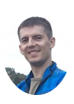

# About me

I'm an _engineer-technologist_ at JSC "Peleng". I help to create modern space equipment.
Took part in the development and implementation of such technological processes as
  - heat removal from circuit board elements,
  - installation of a carrying mirror on three supports,
  - mechanical processing of carbon fiber constructions.

## Interests

- **Traveling around the world.** I like to travel to interesting places both in Belarus and in other countries. I always try to plan the route myself.
- **Do sport.** I love sports. My favorite kinds are orienteering, running and football.
- **Hiking trips.** I love to go kayaking with friends. We like our Belarusian rivers and nature. Such events with friends are always interesting and amazing!

## My works

[PadawansTask1](https://github.com/BSJean/PadawansTask1)

[PadawansTask2](https://github.com/BSJean/PadawansTask2)

[PadawansTask3](https://github.com/BSJean/PadawansTask3)

[PadawansTask4](https://github.com/BSJean/PadawansTask4)

[PadawansTask5](https://github.com/BSJean/PadawansTask5)

[PadawansTask6](https://github.com/BSJean/PadawansTask6)

[FancyCalc](https://github.com/BSJean/FancyCalc)

[PadawansTask7](https://github.com/BSJean/PadawansTask7)

[PadawansTask8](https://github.com/BSJean/PadawansTask8)
